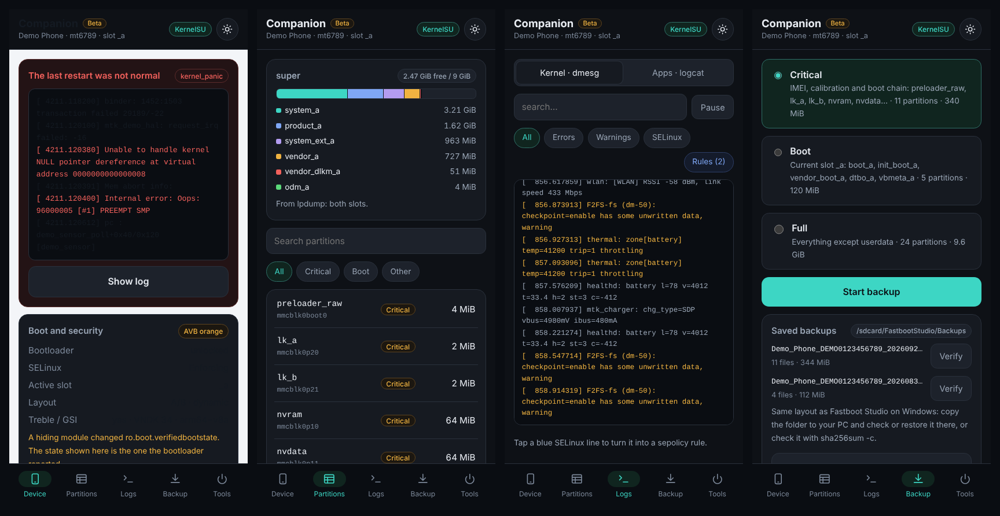
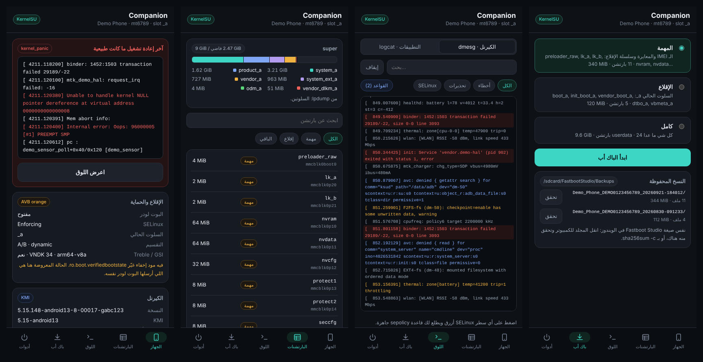

# Fastboot Studio Companion

> **Beta.** This module is experimental. Its version follows Fastboot Studio (v2.3.0), and releases
> are published as pre-releases until it is marked stable.
>
> **تجريبي.** الوحدة في مرحلة تجريبية، ورقم إصدارها نفس Fastboot Studio (v2.3.0)، وإصداراتها تنزل كإصدارات تجريبية لين تصير مستقرة.

A root module for **Magisk, KernelSU and APatch** that goes with
[Fastboot Studio](https://github.com/ifoknr/FastbootStudio) on Windows. It shows what your phone
really is, watches its logs live, and backs up its partitions in the same layout the Windows app
uses, all from the phone itself.

**Read-only by design.** Nothing runs at boot (no `service.sh`, no `post-fs-data.sh`), so it
cannot cause a bootloop, and it never writes to a partition. The only writes are backups and
reports under `/sdcard/FastbootStudio`.



## What it does

| Tab | |
|---|---|
| **Device** | Bootloader and AVB state as the bootloader reported it, even when a hiding module rewrote `ro.boot.verifiedbootstate` · kernel, KMI and security patch · battery health and eMMC/UFS wear · live CPU clocks, temperature and memory |
| **Black box** | When the last restart was a crash, the previous boot's kernel log (pstore) with the panic lines picked out |
| **Partitions** | Everything under `by-name` with sizes and a safety tag (critical, boot, never), plus a map of what is inside `super` |
| **Modules** | Every installed module, and where they get in each other's way: two modules putting the same system file in place, one replacing a whole folder another adds to, or the same property set to different values |
| **Logs** | Live kernel log and logcat with search and filters. Tap an SELinux denial to get a ready `sepolicy.rule` line, or collect all of them at once |
| **Backup** | Critical (IMEI, calibration, boot chain), boot (current slot) or full (everything but userdata), each with `SHA256SUMS` and `backup-info.txt`. Verify any backup on the phone |
| **Tools** | Restart to bootloader, fastbootd, recovery or EDL (Qualcomm), and a support bundle with IMEI, serial and MAC addresses masked |

Arabic and English, following the phone's language.

## Install

Download the zip from [Releases](https://github.com/ifoknr/FastbootStudio-Companion/releases) and
install it from your root manager.

- **KernelSU / APatch:** open the module's WebUI from the Modules page.
- **Magisk:** Magisk has no WebUI of its own. Open the module in [MMRL](https://github.com/MMRLApp/MMRL)
  or WebUI X, or press **Action** in Magisk for a text report.

## Backups and the Windows app

A backup folder looks exactly like one made by Fastboot Studio's Backup page:

```
/sdcard/FastbootStudio/Backups/<model>_<serial>_<yyyyMMdd-HHmmss>/
  nvram.img  nvdata.img  boot_a.img  …
  SHA256SUMS        check with: sha256sum -c SHA256SUMS
  backup-info.txt
```

Copy it to your PC and check or restore it from Fastboot Studio.

## Command line

Everything the WebUI shows comes from one script, which prints JSON, so it can be used from
`adb shell` too:

```
su -c sh /data/adb/modules/fastboot_studio_companion/bin/fbs info
su -c sh /data/adb/modules/fastboot_studio_companion/bin/fbs help
```

## Help and news

- Telegram group: https://t.me/BeNeXTBrO
- Private message: https://t.me/IFOKNR1
- Fastboot Studio for Windows: https://github.com/ifoknr/FastbootStudio/releases/latest

The same links are in the WebUI, under the backups and in About.

## Development

```
SHELLS="dash mksh busybox-sh" sh tests/run.sh   # fbs against a fake phone
CHROME=google-chrome sh tests/webui-smoke.sh    # the WebUI with the demo bridge
sh tools/build.sh                               # dist/FastbootStudio-Companion-vX.Y.Z.zip
```

`module/webroot/index.html` also opens in a normal browser, where `demo.js` stands in for the
root manager with a made-up phone (`?lang=ar`, `?theme=light` and `#log` pick the language, theme and tab).

---

# بالعربي

وحدة روت لـ **Magisk و KernelSU و APatch**، رفيقة لبرنامج Fastboot Studio في الويندوز.

- **للقراءة فقط:** ما يشتغل شي وقت الإقلاع، فما يسبب بوت لوب، وما يكتب على أي بارتشن. الكتابة الوحيدة هي الباك أب والتقارير في `/sdcard/FastbootStudio`.
- **الجهاز:** حالة البوت لودر و AVB من البوت لودر نفسه حتى لو مود إخفاء غيّر الخاصية، والكيرنل و KMI، وصحة البطارية والذاكرة، والمعالج لحظياً.
- **الصندوق الأسود:** إذا الجوال طفى بسبب كراش، يعرض لك لوق الإقلاع اللي قبل مع أسطر الـ panic ملوّنة.
- **البارتشنات:** كل اللي في by-name بأحجامها، وخريطة لمحتوى super.
- **المودات:** يكشف التعارض بين المودات: مودين يحطون نفس ملف النظام، أو مود يستبدل مجلد كامل فيخفي ملفات مود ثاني، أو نفس الخاصية بقيم مختلفة.
- **اللوق:** الكيرنل و logcat لحظياً. اضغط على أي سطر SELinux ويطلع لك قاعدة `sepolicy.rule` جاهزة.
- **الباك أب:** المهمة أو الإقلاع أو كامل، مع `SHA256SUMS` بنفس صيغة برنامج الويندوز، وتقدر تتحقق منه على الجوال.
- **أدوات:** إعادة التشغيل للـ bootloader أو fastbootd أو recovery، وحزمة دعم فني تخفي الـ IMEI والسيريال.



- قروب تيليجرام: https://t.me/BeNeXTBrO
- الخاص: https://t.me/IFOKNR1

## License

MIT
